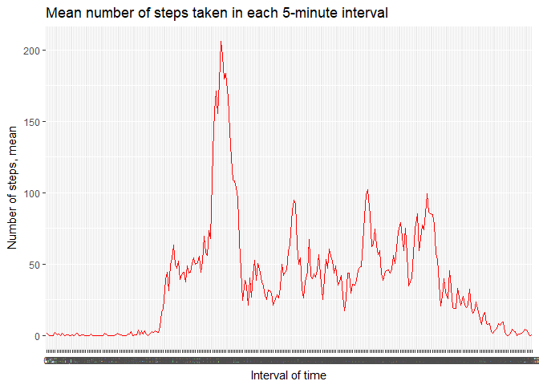
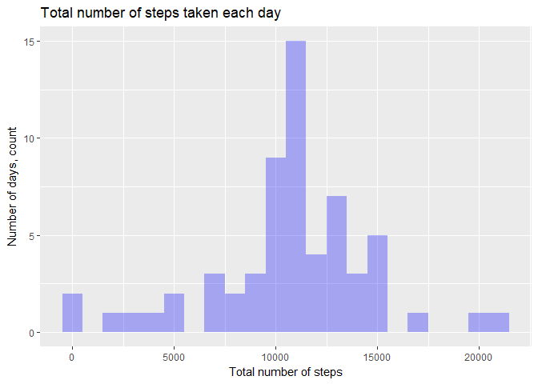

For research we will need functions from external packages.

```r
library(tidyverse)
```

```
## -- Attaching packages -------------------------------------------------------------------------------------------------------------------- tidyverse 1.2.1 --
```

```
## v ggplot2 2.2.1     v purrr   0.2.4
## v tibble  1.4.2     v dplyr   0.7.4
## v tidyr   0.8.0     v stringr 1.3.1
## v readr   1.1.1     v forcats 0.3.0
```

```
## -- Conflicts ----------------------------------------------------------------------------------------------------------------------- tidyverse_conflicts() --
## x dplyr::filter() masks stats::filter()
## x dplyr::lag()    masks stats::lag()
```

## Loading and preprocessing data
Read csv file into variable "data".

```r
data <- read_csv("activity.csv", col_types = "iDi")
```
Check, if there any NAs in data.

```r
apply(apply(data, 2, is.na), 2, sum)
```

```
##    steps     date interval 
##     2304        0        0
```
There are 2304 missing values in the column "steps" in the dataset.
For the further analysis let's make dataframe with additional column "f_interval", which represent intervals as factor variables, and dataframe with no missing values.

```r
mod_data <- data %>%
  mutate(f_interval = as.factor(interval))
complete_data <- filter(mod_data, !is.na(steps))
```

## What is mean total number of steps taken per day?
We will work with dataframe with no missing values, and make new dataframe, that represent total number of steps taken per day.

```r
steps_per_day <- complete_data %>%
  group_by(date) %>%
  summarise(sum = sum(steps))
print(steps_per_day, n=3)
```

```
## # A tibble: 53 x 2
##   date         sum
##   <date>     <int>
## 1 2012-10-02   126
## 2 2012-10-03 11352
## 3 2012-10-04 12116
## # ... with 50 more rows
```
To visualise this dataframe let's make histogramm of total number of staps taken per day:

```r
steps_per_day_ggplot <- ggplot(data = steps_per_day, mapping = aes(x = date, y = sum)) + 
  geom_histogram(stat = "identity", fill = "blue", alpha = 0.3) +
  labs(x = "Date, month*day", y = "Number of steps, count", title = "Total number of steps taken each day")
```

```
## Warning: Ignoring unknown parameters: binwidth, bins, pad
```

```r
print(steps_per_day_ggplot)
```

<!-- -->

Mean and median of total number of staps taken per day:

```r
mean_steps_per_day <- mean(steps_per_day$sum)
median_steps_per_day <- median(steps_per_day$sum)
print(paste("Mean:", round(mean_steps_per_day, 1), " ", "Median:", median_steps_per_day))
```

```
## [1] "Mean: 10766.2   Median: 10765"
```

## What is the average daily activity pattern?
We will work with dataframe with no missing values, and make new dataframe, that represent total number of steps taken per interval.

```r
steps_per_interval <- complete_data %>%
  group_by(f_interval) %>%
  summarise(sum = sum(steps))
print(steps_per_interval, n=3)
```

```
## # A tibble: 288 x 2
##   f_interval   sum
##   <fct>      <int>
## 1 0             91
## 2 5             18
## 3 10             7
## # ... with 285 more rows
```
To visualise this dataframe let's make histogramm of total number of staps taken per interval:

```r
steps_per_interval_ggplot <- ggplot(data = steps_per_interval, mapping = aes(x = f_interval, y = sum)) + 
  geom_histogram(stat = "identity", fill = "red", alpha = 0.3) +
  labs(x = "Interval of time", y = "Number of steps, count", title = "Total number of steps taken in each 5-minute interval")
```

```
## Warning: Ignoring unknown parameters: binwidth, bins, pad
```

```r
print(steps_per_interval_ggplot)
```

<!-- -->

Interval, which contains, on average, the maximum number of steps:

```r
interval_with_max_steps <- as.character(arrange(steps_per_interval, desc(sum))[["f_interval"]][1])
print(paste("Interval of maximum:", interval_with_max_steps))
```

```
## [1] "Interval of maximum: 835"
```
So, it is interval, which corresponds to 8:35 am.

## Imputing missing values
Total number of missing values in the dataset:

```r
sum(!complete.cases(data))
```

```
## [1] 2304
```
As we previously saw, all missing valius in dataset is in colums "steps".
Lets make new dataframe with colums "step_filled", in which all the values are same as in "steps", except NAs are replaced by the mean values of steps in the same time interval across all dataset.  
First let's make dataframe with mean values of steps:

```r
mean_steps_per_interval <- complete_data %>%
  group_by(f_interval) %>%
  summarise(mean = mean(steps))
print(mean_steps_per_interval, n=3)
```

```
## # A tibble: 288 x 2
##   f_interval  mean
##   <fct>      <dbl>
## 1 0          1.72 
## 2 5          0.340
## 3 10         0.132
## # ... with 285 more rows
```
Then let's apply replacement function to the "steps" column and make new dataframe "data_filled".

```r
step_fill <- function (step, inter) {
  if (is.na(step)){
    mean_steps_per_interval[mean_steps_per_interval$f_interval == inter,][[2]]
  }
  else step
}

data_filled <- mod_data %>%
  mutate(steps_filled = mapply(step_fill, steps, f_interval))
print(data_filled, n=3)
```

```
## # A tibble: 17,568 x 5
##   steps date       interval f_interval steps_filled
##   <int> <date>        <int> <fct>             <dbl>
## 1    NA 2012-10-01        0 0                 1.72 
## 2    NA 2012-10-01        5 5                 0.340
## 3    NA 2012-10-01       10 10                0.132
## # ... with 1.756e+04 more rows
```
Now let's make histogramm of total number of staps taken per day, based on our new "steps_filled" value:

```r
steps_per_day_filled <- data_filled %>%
  group_by(date) %>%
  summarise(sum = sum(steps_filled))

steps_per_day_filled_ggplot <- ggplot(data = steps_per_day_filled, mapping = aes(x = date, y = sum)) +
  geom_histogram(stat = "identity", fill = "blue", alpha = 0.3) +
  labs(x = "Date, month*day", y = "Number of steps, count", title = "Total number of steps taken each day, NA are filled")
```

```
## Warning: Ignoring unknown parameters: binwidth, bins, pad
```

```r
print(steps_per_day_filled_ggplot)
```

<!-- -->

On histogramm there are much fewer days with almost no step count, but there are still some days (e.g. 2012-10-13), where step count is much lower than count on other days.

```r
mean_steps_per_day_filled <- mean(steps_per_day_filled$sum)
median_steps_per_day_filled <- median(steps_per_day_filled$sum)
print(paste("New mean:", round(mean_steps_per_day_filled, 1), " ", "New median:", round(median_steps_per_day_filled)))
```

```
## [1] "New mean: 10766.2   New median: 10766"
```
Mean and median almost didn't change, which is a good sign.

## Are there differences in activity patterns between weekdays and weekends?
Let's create new dataframe with factor variable in the dataset with two levels - "weekday" and "weekend"

```r
week_day_end <- function (day) {
  if (day == "Saturday" | day == "Sunday") {
    "weekend"
  } else {
    "weekday"
  }
}

steps_per_weekday <- data_filled %>%
  mutate(wday = weekdays(date), weekde = as.factor(map_chr(wday ,week_day_end))) %>%
  select(steps_filled, f_interval, weekde)
print(steps_per_weekday, n=3)
```

```
## # A tibble: 17,568 x 3
##   steps_filled f_interval weekde 
##          <dbl> <fct>      <fct>  
## 1        1.72  0          weekday
## 2        0.340 5          weekday
## 3        0.132 10         weekday
## # ... with 1.756e+04 more rows
```

```r
table(steps_per_weekday$weekde)
```

```
## 
## weekday weekend 
##   12960    4608
```
To illustrate differences in activity patterns between weekdays and weekends lets make a panel plot based on new "weekday"/"weekend" variable:

```r
steps_per_weekday_interval <- steps_per_weekday %>%
  group_by(f_interval, weekde) %>%
  summarise(mean_steps = mean(steps_filled))

steps_per_interval_filled_week_ggplot <- ggplot(data = steps_per_weekday_interval, mapping = aes(x = f_interval, y = mean_steps, fill = weekde)) +
  geom_histogram(stat = "identity") +
  facet_wrap(~ weekde, nrow = 2) +
  labs(x = "Time of the day, 5 min intervals", y = "Number of steps, count", title = "Number of steps taken in weekdays and weekends") +
  guides(fill=FALSE)
```

```
## Warning: Ignoring unknown parameters: binwidth, bins, pad
```

```r
print(steps_per_interval_filled_week_ggplot)
```

<!-- -->

We can see some differences in activity patterns between weekdays and weekends.
